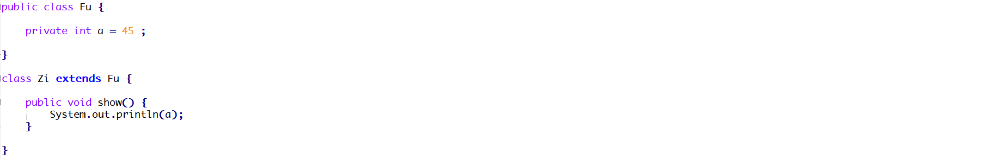
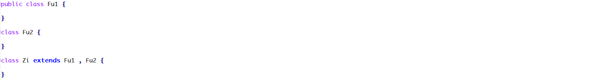
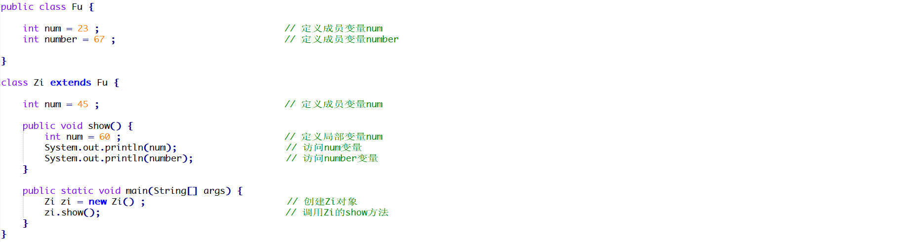
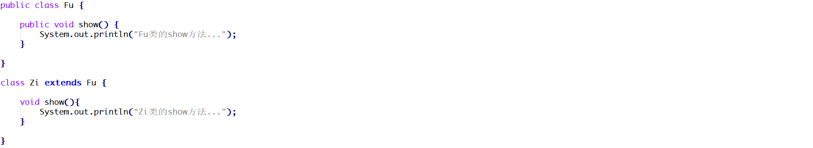
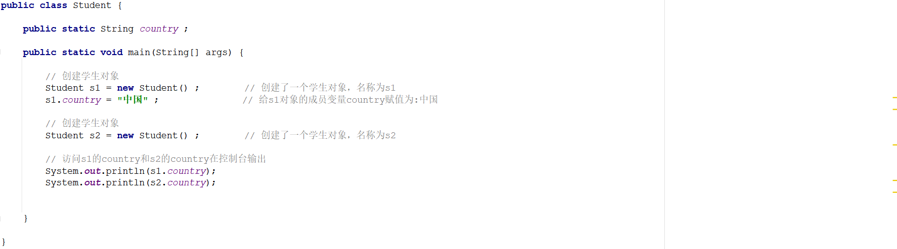
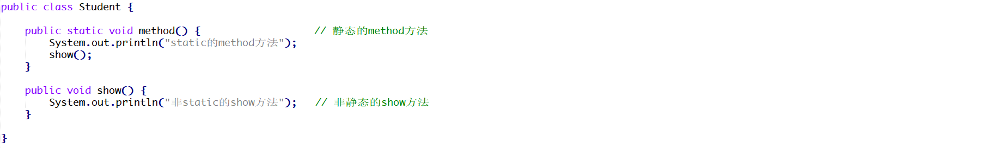
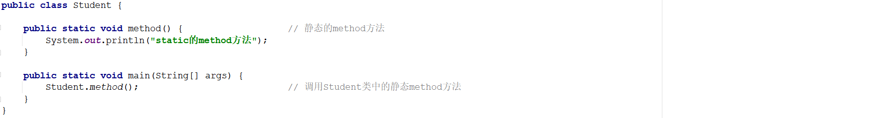

### 一 单选题

#### 题目1

权限修饰符的权限从大到下排序正确的是?( )

A. public>protected>private>默认

B. public>private>protected>默认

C. public>默认>protected>private

D. public>protected>默认>private


#### 题目2

在java中,下面选项中关于继承的说法错误的是(  )

A. 继承可以描述类与类之间的关系

B. 继承实现了代码的重用

C. 具有继承关系的子类和父类层次结构更加清晰

D. 子类中可以重写父类中的所有方法


### 二 多选题

#### 题目1

以下关于静态方法，说法正确的是？（）

A. 被类的所有对象共享

B. 只可以通过对象调用

C. 优先于对象存在

D. 随着类的加载而加载

#### 题目2

方法重写描述正确的是?( )

A. 同名方法并且在同一个类里面

B. 同名方法并且有继承关系的两个类里面

C. 参数列表必须相同

D. 返回值必须相同


### 二 简答题

#### 题目1

下面程序编译是否会报错并说明原因？

 

```java

```

#### 题目2

下面程序编译是否会报错并说明原因？

 

```java

```

#### 题目3

下面程序执行完毕以后在控制台输出的结果是什么并说明原因？如果想输出23和45代码应该怎么书写？

 

```java

```

```java

```

#### 题目4

下面程序编译是否会报错并说明原因？

 

```java

```

#### 题目5

请分析如下程序在控制台的执行结果并说明原因？

 

```java

```

#### 题目6

请分析如下程序编译是否会报错并说明原因？

 

```java

```

#### 题目7

请分析如下程序编译是否会报错并说明原因？

 

```java

```


### 三 编程题

#### 题目1

每一款手机都有自己的品牌和价格,原来的手机只能打电话,发短信,来电显示只能显示手机号;现在的新手机针对于来电显示做了功能的升级,还能显示头像,还能显示归属地,请设计程序,完成手机的升级!

**训练提示**

```
新手机在老手机的基本功能基础上,针对老手机的某个功能进行重新实现
```

**实现步骤**

```
1.定一个OldPhone类,定义两个私有属性brand和price,定义空参和有参构造方法,get/set方法
2.在OldPhone类中,定义一个打电话的方法,传递姓名的参数,方法体内输出给谁打电话
3.在OldPhone类中,定义一个发短信的方法,直接输出"发短信"
4.定义一个来电显示的方法,输出内容为"显示手机号",
4.定一个子类NewPhone,继承OldPhone类,在子类中重写来电显示的方法,输出内容为"显示手机号","显示归属地","显示头像"
5.定义测试类,创建NewPhone类对象,调用set方法为属性赋值,调用get方法获取属性值
6.调用从父类中继承过来的方法以及重写的方法
```

**参考答案**

```java

```

```java

```

```java

```
