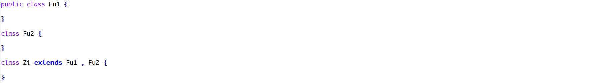
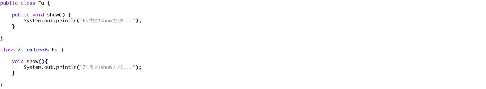
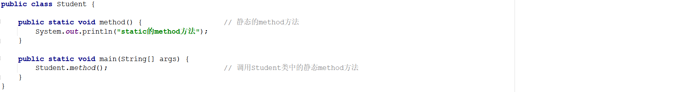

### 一 单选题

#### 题目1

权限修饰符的权限从大到下排序正确的是?( D)

A. public>protected>private>默认

B. public>private>protected>默认

C. public>默认>protected>private

D. public>protected>默认>private

#### 题目2

在java中,下面选项中关于继承的说法错误的是(D  )

A. 继承可以描述类与类之间的关系

B. 继承实现了代码的重用

C. 具有继承关系的子类和父类层次结构更加清晰

D. 子类中可以重写父类中的所有方法


### 二 多选题

#### 题目1

以下关于静态方法，说法正确的是？（ACD）

A. 被类的所有对象共享

B. 只可以通过对象调用

C. 优先于对象存在

D. 随着类的加载而加载

#### 题目2

方法重写描述正确的是?(BCD )

A. 同名方法并且在同一个类里面

B. 同名方法并且有继承关系的两个类里面

C. 参数列表必须相同

D. 返回值必须相同


### 二 简答题

#### 题目1

下面程序编译是否会报错并说明原因？

 

```java
答：
① 会报错
② 原因：子类继承父类，子类只能访问父类非私有的成员。而Fu类中定义的成员变量a是私有的，因此Zi类无法进行访问，编译报错。    
```

#### 题目2

下面程序编译是否会报错并说明原因？

 

```java
答:
① 会报错
② 原因：在Java语言中是不支持多继承的。而题目中的Zi类继承了两个父类：Fu1 ， Fu2不符合Java的语法规则，编译报错。     
```

#### 题目3

下面程序执行完毕以后在控制台输出的结果是什么并说明原因？如果想输出23和45代码应该怎么书写？

 

```java
答：
① 输出结果：60 ， 67
② 原因：变量的访问遵循就近原则。查找顺序为：1、子类局部范围找 	2、子类成员范围找	3、父类成员范围找	4、如果都没有就报错(不考虑父亲的父亲…)
   show方法的局部位置定义了num变量，因此访问的是局部变量的num，控制台输出60。
   number变量，局部位置和子类的成员位置都没有该变量，因此访问的是Fu类的成员变量number，因此控制台输出67。
③ 想输出23和45可以使用super关键字和this关键字显示的去访问成员变量，如下所示：    
```

```java
System.out.println(super.num);			// 访问父类的成员变量num
System.out.println(this.num);			// 访问子类的成员变量num
```

#### 题目4

下面程序编译是否会报错并说明原因？

 

```java
答：
① 会报错
② 原因：子类在重写父类方法的时候，要求方法的访问权限不能低于父类。而代码中Zi的show方法没有添加访问权限，那么使用的就是默认的访问权限，而默认的访问权限小于public的，因此编译报错。 
```

#### 题目5

请分析如下程序在控制台的执行结果并说明原因？

 

```java
答：
① 执行结果：
    中国
    中国
② 原因：被static修饰的成员被该类的所有对象所共享。代码中的country被static修饰了，因此该成员变量会被Student的多个对象所共享，因此在控制台输出了两次中国
```

#### 题目6

请分析如下程序编译是否会报错并说明原因？

 

```java
答：
① 会报错
② 原因：show方法是非静态的，method方法是静态的，而静态只能访问静态。而代码中是通过静态的method方法访问了非静态的show方法，因此会报错。    
```

#### 题目7

请分析如下程序编译是否会报错并说明原因？

 

```java
答：
① 不会报错
② 原因：静态的method方法可以通过Student类名直接进行访问    
```


### 三 编程题

#### 题目1

每一款手机都有自己的品牌和价格,原来的手机只能打电话,发短信,来电显示只能显示手机号;现在的新手机针对于来电显示做了功能的升级,还能显示头像,还能显示归属地,请设计程序,完成手机的升级!

**训练提示**

```
新手机在老手机的基本功能基础上,针对老手机的某个功能进行重新实现
```

**实现步骤**

```
1.定一个OldPhone类,定义两个私有属性brand和price,定义空参和有参构造方法,get/set方法
2.在OldPhone类中,定义一个打电话的方法,传递姓名的参数,方法体内输出给谁打电话
3.在OldPhone类中,定义一个发短信的方法,直接输出"发短信"
4.定义一个来电显示的方法,输出内容为"显示手机号",
4.定一个子类NewPhone,继承OldPhone类,在子类中重写来电显示的方法,输出内容为"显示手机号","显示归属地","显示头像"
5.定义测试类,创建NewPhone类对象,调用set方法为属性赋值,调用get方法获取属性值
6.调用从父类中继承过来的方法以及重写的方法
```

**参考答案**

```java
//父类-->老手机
public class OldPhone {
    private String brand;
    private double price;

    public OldPhone() {
    }

    public OldPhone(String brand, double price) {
        this.brand = brand;
        this.price = price;
    }

    public String getBrand() {
        return brand;
    }

    public void setBrand(String brand) {
        this.brand = brand;
    }

    public double getPrice() {
        return price;
    }

    public void setPrice(double price) {
        this.price = price;
    }

    //定义打电话方法
    public void call(String name){
        System.out.println("给"+name+"打电话!");
    }

    //发短信
    public void message(){
        System.out.println("发短信!");
    }

    //来电显示
    public void show(){
        System.out.println("显示手机号!");
    }

}
```

```java
//新手机
public class NewPhone extends OldPhone {
    //来电显示功能升级方法
    public void show() {
        super.show();
        System.out.println("显示归属地!");
        System.out.println("显示头像!");
    }
}
```

```java
//测试类
public class Test {
    public static void main(String[] args) {
        //创建子类对象
        NewPhone newPhone = new NewPhone();
        //调用set方法为属性赋值
        newPhone.setBrand("苹果");
        newPhone.setPrice(9800);
        //调用get方法获取属性值
        System.out.println("手机品牌为:"+newPhone.getBrand()+",价格为:"+newPhone.getPrice());
        //调用继承过来的方法
        newPhone.call("柳岩");
        newPhone.message();
        //调用重写后的方法
        newPhone.show();
    }
}
```
