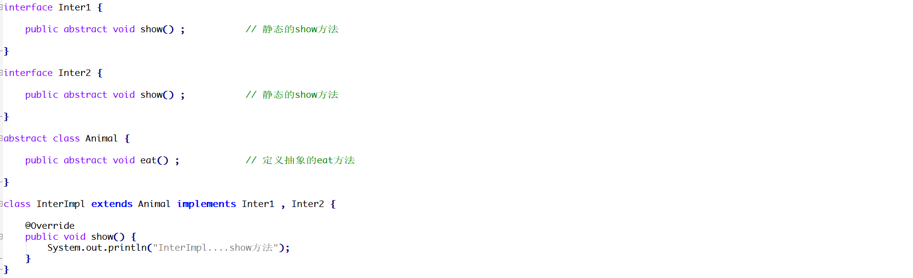
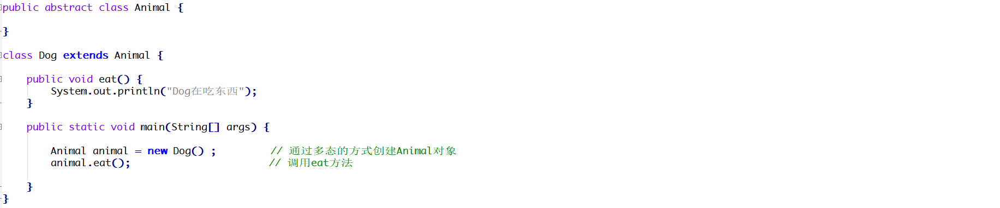

# 1 简答题

## 1.1 简答题一

请分析如下程序是否会报错(编译版本JDK1.8)并说明原因？并给出正确的代码！

|  |
| ------------------------------------------------------------ |

```java
答：
```

## 1.2 简答题二

请分析如下程序是否会报错并说明原因？并给出正确的代码！

|  |
| ------------------------------------------------------------ |

```java
答：
```

## 1.3 简答题三

请分析如下程序是否会报错并说明原因？并给出正确的代码！

|  |
| ------------------------------------------------------------ |

```java
答：
```

## 1.4 简答题四

请分析如下程序那几行代码会报错并说明原因？

|  |
| ------------------------------------------------------------ |

```java
答：
```

## 1.5 简答题五

请分析如下程序是否会报错并说明原因？并给出正确的代码！

|  |
| ------------------------------------------------------------ |

```java
答：
```

## 1.6 简答题六

请分析如下程序是否会报错并说明原因？

|  |
| ------------------------------------------------------------ |

```java
答：
```

## 1.7 简答题七

请分析如下程序在控制台的输出结果是什么并说明原因？

|  |
| ------------------------------------------------------------ |

```java
答：
```

## 1.8 简答题八

请分析如下程序在控制台的输出结果是什么并说明原因？以及如何避免该问题？

|  |
| ------------------------------------------------------------ |

```java
答：
```

编码题

## 2 编程题目

**训练目标**：掌握Java中抽象类以及继承的使用，以及理解其在开发中的应用

**需求背景**：在现在的互联网系统中大部分的网站都是支持手机号码登录的，当用户输入完手机号码点击获取短信验证码此时就会访问一些短信平台，由短信平台(阿里云短信平台、腾讯云短信平台)给用户

的手机号码上发送一个短信验证码！如下图所示：

|  |
| ------------------------------------------------------------ |

发送短信验证码的大致逻辑如下所示：

1、生成一个4位的随机的数字字符串

2、访问指定的短信服务平台让其完成验证码的发送

3、将验证码数据进行存储

**需求描述**：在素材的msg项目的AliyunSendMsg类和TencentSendMsg的指定位置补全代码，并使用模板设计模式对代码进行优化。实现短信验证码发送功能！案例实现效果如下所示：

1、当在Entry类中创建AliyunSendMsg对象时，在控制台输出

|  |
| ------------------------------------------------------------ |

2、当在Entry类中创建TencentSendMsg对象时，在控制台输出

|  |
| ------------------------------------------------------------ |

**实现提示**：

1、生成一个4位随机字符串(字符来源于chs数组)

2、发送短信验证码(由于知识储备不足，此处可以通过输出语句进行模拟)

3、创建CheckCode对象，将该对象存储到arrayList集合中

4、将AliyunSendMsg和TencentSendMsg中相同的代码向上进行抽取，将其定义到一个模板类中，然后让AliyunSendMsg和TencentSendMsg继承该类


