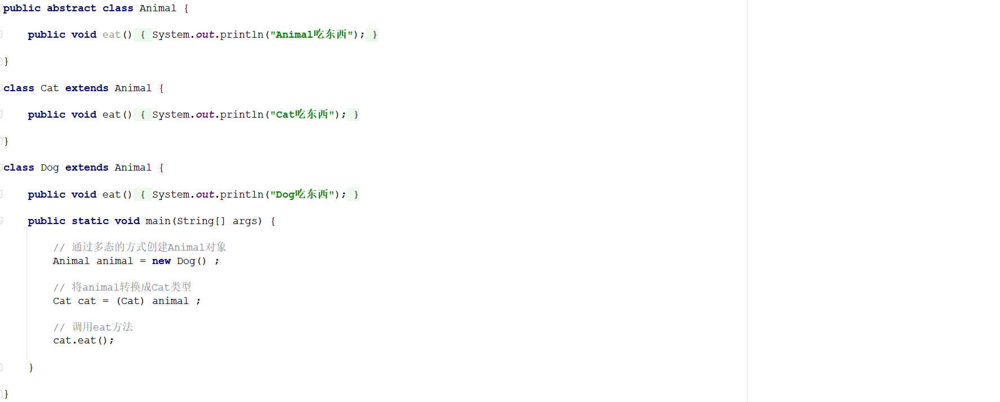

# 1 简答题

## 1.1 简答题一

请分析如下程序是否会报错(编译版本JDK1.8)并说明原因？并给出正确的代码！

|  |
| ------------------------------------------------------------ |

```java
答：
① 会报错    
② 原因：上述method方法不是一个default方法，因此在JDK1.8时编译不通过
③ 正确代码：
```

```java
public default void method() {                          // 定义一个非抽象的method方法
	System.out.println("非抽象的method方法");
}
```

## 1.2 简答题二

请分析如下程序是否会报错并说明原因？并给出正确的代码！

|  |
| ------------------------------------------------------------ |

```java
答：
① 会报错    
② 原因：类和接口是实现的关系，不是继承关系
③ 正确代码： 
```

```java
class InterImpl implements Inter {          // 定义一个类，继承Inter接口

}
```

## 1.3 简答题三

请分析如下程序是否会报错并说明原因？并给出正确的代码！

|  |
| ------------------------------------------------------------ |

```java
答：
① 会报错
② 原因：接口和接口之间的关系是继承的关系，不是实现的关系
③ 正确代码：    
```

```java
public interface Inter extends Inter1 , Inter2 {

}
```


## 1.4 简答题四

请分析如下程序那几行代码会报错并说明原因？

|  |
| ------------------------------------------------------------ |

```java
答：
① 第10行代码会报错
② 原因：接口中的成员变量存在默认的修饰符：public static final 因此number是一个常量，其值不能被改变    
```


## 1.5 简答题五

请分析如下程序是否会报错并说明原因？并给出正确的代码！

|  |
| ------------------------------------------------------------ |

```java
答：
① 会报错
② 原因：InterImpl不是一个抽象类，那么此时就需要重写Animal类以及Inter1和Inter2中所有的抽象方法。但是InterImpl没有重写Animal类中的eat方法，因此会报错。
```

## 1.6 简答题六

请分析如下程序是否会报错并说明原因？

|  |
| ------------------------------------------------------------ |

```java
答：
① 会报错
② 原因：通过多态创建Animal对象，在编译的时候需要查看Animal类中是否定义了eat方法，如果定义了编译通过，如果没有定义编译不通过！而在Animal类中并没有定义eat方法，因此编译报错。   
```

## 1.7 简答题七

请分析如下程序在控制台的输出结果是什么并说明原因？

|  |
| ------------------------------------------------------------ |

```java
答：
① 控制台输出结果：
   6
   Dog吃东西 
② 原因：
   1、通过多态的形式访问成员变量：编译看左边，运行看左边     在Animal类中定义了int类型的成员变量age因此编译通过，运行时打印的是Animal类中的成员变量的值：6
   2、通过多态的形式访问成员方法：编译看左边，运行看右边     在Animal类中定义了eat方法因此编译通过，运行时执行的是Dog类中的eat方法，因此控制台输出："Dog吃东西"
```

## 1.8 简答题八

请分析如下程序在控制台的输出结果是什么并说明原因？以及如何避免该问题？

|  |
| ------------------------------------------------------------ |

```java
答：
① 控制台输出结果：
    Exception in thread "main" java.lang.ClassCastException: com.itheima.inter.demo08.Dog cannot be cast to com.itheima.inter.demo08.Cat
		at com.itheima.inter.demo08.Dog.main(Animal.java:31)
② 原因：Animal本质的类型为Dog，不能将Dog转换成Cat，Dog和Cat之间不存在子父类的继承关系
③ 避免该问题：在进行类型转换的时候，可以通过instanceof关键字进行类型的判断，使用方式如下所示：       
```

```java
// 通过多态的方式创建Animal对象
Animal animal = new Dog() ;

// 将animal转换成Cat类型
if(animal instanceof Cat) {

    Cat cat = (Cat) animal ;

    // 调用eat方法
    cat.eat();

}
```
