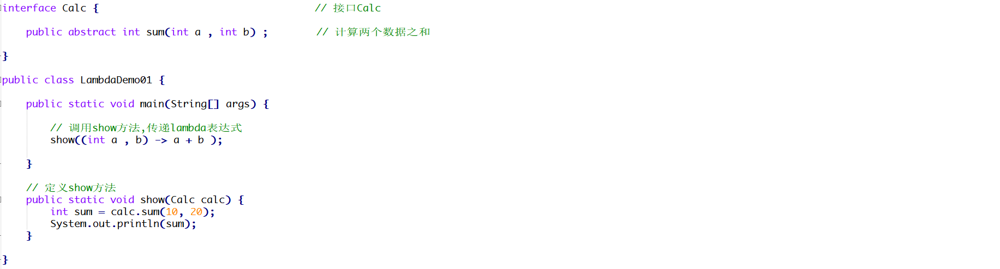
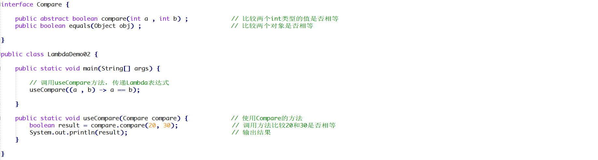
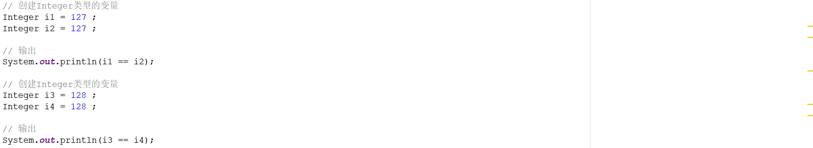

# 1 简答题


## 1.1 简答题一

请分析如下程序是否会报错并说明原因？并给出正确的代码！

 

```java

```

## 1.2 简答题二

请分析如下程序是否会报错并说明原因？并给出正确的代码！

 

```java

```

## 1.3 简答题三

下面lambda表达式的书写是否正确并说明原因？并给出正确的代码！

 

```java

```

## 1.4 简答题四

请分析如下程序是否会报错并说明原因？  

```java

```

## 1.5 简答题五

请分析如下程序执行完毕以后在控制台的输出结果是什么并说明原因？

 

```java

```

## 1.6 简答题六

请分析如下程序执行完毕以后在控制台的输出结果是什么并说明原因？

 

```java

```

## 1.7 简答题七

请分析如下程序执行完毕以后在控制台的输出结果是什么并说明原因？

 

```java

```

```java

```

```java

```


