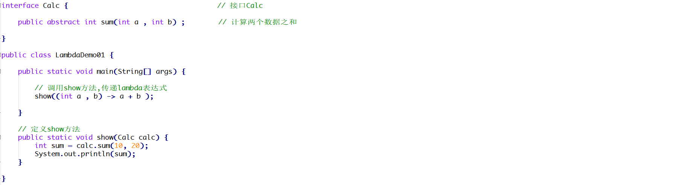
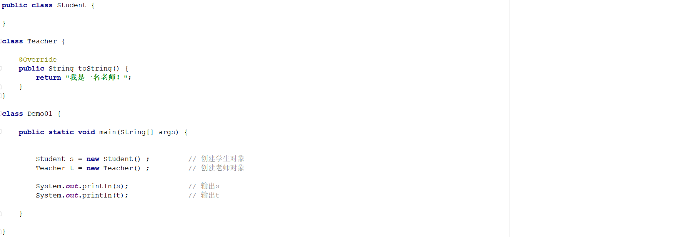
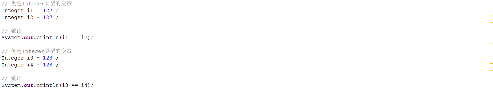

# 1 简答题


## 1.1 简答题一

请分析如下程序是否会报错并说明原因？并给出正确的代码！

 

```java
答：
① 会报错
② 原因：在外部类中创建一个非静态的成员内部类对象格式不对
③ 正确代码：Demo02.Inner inner = new Demo02().new Inner() ;    
```

## 1.2 简答题二

请分析如下程序是否会报错并说明原因？并给出正确的代码！

 

```java
答：
① 会报错
② 原因：在外部类中创建一个静态的成员内部类对象格式不对
③ 正确代码：Demo03.Inner inner = new Demo03.Inner();
```

## 1.3 简答题三

下面lambda表达式的书写是否正确并说明原因？并给出正确的代码！

 

```java
答：
① 不正确
② 原因：lambda表达式的省略格式，如果有多个参数，参数类型在省略的时候需要全部省略。而代码中的lambda表达式在省略参数类型的时候只省略了一个参数类型。
③ 正确代码：show((int a , int b) -> a + b ); 或者 show((a , b) -> a + b );
```

## 1.4 简答题四

请分析如下程序是否会报错并说明原因？  

```java
答：
① 不会报错
② 原因：Compare接口中的equals抽象方法，是Object类中的equals方法的抽象表示形式。lambda表达式可以看做成是匿名内部类的简化写法，一个类都会直接的或者间接的继承Obejct类，那么通过Object类中的equals方法可以重写接口中定义的抽象的equals方法。因此可以认为Comapre接口只定义了一个抽象方法compare，是可以使用lambda表达式的。    
```

## 1.5 简答题五

请分析如下程序执行完毕以后在控制台的输出结果是什么并说明原因？

 

```java
① 控制台输出结果：false，false
② 原因：
    1、使用==比较两个对象是否相等，比较的是地址值。由于是两个对象因此地址值肯定不一样，所以在控制台输出false。   
    2、调用equals方法比较的时候，由于Student类没有重写Object类中的equals方法，因此调用的还是Object类中的equals方法，那么比较的还是地址值，因此控制台输出false
```

## 1.6 简答题六

请分析如下程序执行完毕以后在控制台的输出结果是什么并说明原因？

 

```java
答：
① 控制台输出结果：
    com.itheima.object.demo00.Student@4554617c
	我是一名老师！
② 原因：
    直接输出对象名称，默认会调用对象的toString方法。Student类没有重写Object类中的toString方法，因此调用的是Object类中的toString方法，所以打印的是地址值
    Teacher类重写了Object类中的toString方法，因此打印的是“我是一名老师！”
```

## 1.7 简答题七

请分析如下程序执行完毕以后在控制台的输出结果是什么并说明原因？

 

```java
答：
① 控制台输出结果：true，false
② 原因：自动装箱调用的是Integer类中的valueOf方法，于是查询valueOf方法的源码，如下所示：    
```

```java
public static Integer valueOf(int i) {
    if (i >= IntegerCache.low && i <= IntegerCache.high)	// 判断i是否大于等于-128并且小于等于127，如果是直接从数据中获取元素
        return IntegerCache.cache[i + (-IntegerCache.low)];
    return new Integer(i);									// 如果不满足上述条件直接new一个新的对象
}
```

```java
127满足上述的第一个条件，因此是从数组中获取元素，地址值相同，因此控制台输出true！
128不满足上述第一个条件，因此是又重新new了一个全新的对象，因此控制台输出false！    
```


