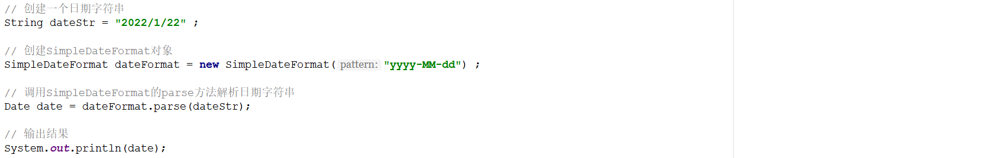

# 1 选择题

## 题目1(单选)

​	下列选项中,关于StringBuilder的说法正确的是 ( C ) 

​	A:  StringBuilder和String都是字符串类，所以它们所有方法都是相同的 

  	B:  StringBuilder和String都是字符串类，它们所有的构造方法都是相同的 

​	C:  可以通过构造方法public StringBuilder(String str)把一个String对象转为StringBuilder对象 

​	D:  StringBuilder的对象可以使用字符串赋值，如：StringBuilder sb = "abc"; 


------

## 题目2(单选)

阅读如下代码, 选择出正确的运行结果( B )

```java
public class Test {
    public static void main(String[]args) {
       StringBuilder sb = newStringBuilder("a");

       sb.append("b");

       sb.append("c");

       sb.append("ddd");

       sb.append("e");

       System.out.println(sb.length());

    }

}
```

​	A:  5 

  	B:  7

​	C:  4

​	D:  0


------

## 题目3(单选)

​	请查看以下代码,正确的结果是( D ) 

```java
StringBuilder sb = new StringBuilder();
sb.append("a"); 
sb.append("b").append("c").reverse(); 
System.out.println(sb.toString()); 
```

​	A:   	cab   

​        B: 	ABC 

​	C: 	abc 

​	D:  	cba

## 题目4(单选)

下列代码的功能是字符串转换成日期类型:( A )

```java
import java.text.ParseException;
import java.text.SimpleDateFormat;
import java.util.Date;

public class Test01 {
    public static void main(String[] args) throws ______________ {
        String s = "2088-08-08 08:08:08";
        SimpleDateFormat sdf = new SimpleDateFormat("________________");
        Date date = sdf.________(s);
        System.out.println(date);
    }
}
```

A、 ①ParseException
②yyyy-MM-dd HH:mm:ss
③parse

 B、 ①NullException
②yyyy年MM月dd日 HH时mm分ss秒
③parse

 C、 ①ParseException
②yyyy年MM月dd日 HH时mm分ss秒
③format 

 D、 ①ParseException
②yyyy-MM-dd HH:mm:ss
③format

## 题目5(单选)

观察下列代码.日期格式化为字符串是(时间忽略)? ( B  )

```java
public class SimpleDateFormatDemo {
    public static void main(String[] args) throws ParseException {
        SimpleDateFormat sdf = new SimpleDateFormat("yyyy年MM月dd日 HH:mm:ss");
        Date date = new Date();
        String s = sdf.format(date);
        System.out.println(s);
    }
}

```

 A、 2018/04/11 22:01:30

 B、  2018年04月11日 22:01:30

 C、 2018.04.11 22:01:30

 D、 2018-04-11 22时01分30秒

##  题目6(多选)

**下面对日期类常用方法说法正确的是**(ABCD)

 A、 long getTime() : 把日期对象转换成对应的时间毫秒值。 

 B、 SimpleDateFormat(String pattern) :构造一个SimpleDateFormat，使用给定的模式或默认的日期格式

 C、 format(): 将Date对象格式化为字符串 

 D、 parse (): 将字符串解析为Date对象 


# 2 简答题

## 2.1 简答题一

如下程序：

 

执行完毕以后在控制台的数据结果为：

 

请说明产生该结果的原因，并且给出精确输出(得到结果为0.2)的代码！

```java
答：
① 原因：不论是float 还是double都是浮点数，而计算机是二进制的，浮点数会失去一定的精确度，因此导致控制台输出结果中出现了精度丢失的问题。
② 精确输出：需要使用jdk中的BigDecimal类进行计算，代码如下所示：
```

```java
// 创建两个BigDecimal对象
BigDecimal b1 = new BigDecimal("0.01") ;
BigDecimal b2 = new BigDecimal("0.05") ;

// 做除法运算将结果输出到控制台
System.out.println(b1.divide(b2));
```

## 2.2 简答题二

请说明下述程序执行完毕以后在控制台的输出结果是什么并说明原因？

 

```java
答：
① 程序运行结果：
    Exception in thread "main" java.text.ParseException: Unparseable date: "2022/1/22"
        at java.text.DateFormat.parse(DateFormat.java:366)
        at com.itheima.date.demo01.DateDemo01.main(DateDemo01.java:18)
② 原因：
    SimpleDateFormat所指定的日期格式和日期字符串的日期格式不匹配
```


# 3 编程题

## 3.1 编程题目一

**训练目标**

掌握日期时间API

**需求**：通过键盘录入自己的生日(格式如下:2000年10月10日),计算自己已经出生多少天

**训练提示**

1 键盘录入指定格式的生日字符串

2 使用SimpleDateFormat的parse方法，把字符串解析为Date格式的出生日期

3 获取生日对应的毫秒值

4 获取当前日期的毫秒值

5 将二个毫秒值的差值转换为天

```java
public class Test1 {
    public static void main(String[] args) throws ParseException {
        // 1.键盘录入指定格式的生日字符串
        Scanner scanner = new Scanner(System.in);
        System.out.println("请输入你的出生日期，格式：yyyy年MM月dd日");
        String birthdayDateString = scanner.next();

        //2.使用SimpleDateFormat的parse方法，把字符串解析为Date格式的出生日期
        SimpleDateFormat sdf = new SimpleDateFormat("yyyy年MM月dd日");
        Date birthdayDate = sdf.parse(birthdayDateString);

        //3.获取生日对应的毫秒值
        long birthdayDateTime = birthdayDate.getTime();

        //4. 获取当前的日期的毫秒值
        long todayTime = new Date().getTime();

        //5.使用当前日期的毫秒值 - 出生日期的毫秒值
        long time = todayTime - birthdayDateTime;

        //6.将毫秒值转换为天(s/1000/60/60/24)
        long day = time / 1000 / 60 / 60 / 24;
        System.out.println("你已经出生了" + day + "天");

    }
}
```

## 3.2 编程题目二

在登录注册页面中，除了用户名和密码外，通常也会包含验证码。验证码是用来区分用户是计算机还是人，防止恶意破解密码、刷票、灌水等行为。

请查看Random、StringBuilder相关API，定义方法，获取一个包含4个字符的验证码，每一位字符是随机选择的字母和数字，可包含a-z,A-Z,0-9。例如：

```java
7Kt5
```

训练目标

随机数类Random相关API、可变的字符序列StringBuilder相关API

训练提示

1、功能需要定义方法实现，方法的返回值是什么？需要参数列表吗？

2、先将可选择的字符都放到一个StringBuilder对象中。

3、怎样随机获取其中的四个字符呢？如果能随机获取一个，再获取四次，就可以了。那么怎样随机获取一个呢？我们知道，字符串中的字符是有索引的，如果可以随机获取到一个索引，就相当于随机获取到了该索引上的字符。

实现步骤

1、定义方法，返回值是String，参数列表为空。

2、定义StringBuilder对象，将可选择的字符都放到StringBuilder对象中。

​	2.1、定义循环从a-z，使用StringBuilder的append方法依次添加所有小写字母

​	2.2、定义循环从A-Z，使用StringBuilder的append方法依次添加所有大写字母

​	2.3、定义循环从0-9，使用StringBuilder的append方法依次添加所有数字字符

3、创建Random对象。定义一个空字符串用于保存验证码。

4、定义一个执行4次的循环，用于获取4个字符。

​	4.1、在循环中，使用Random的nextInt方法，随机获取一个从索引0(包含）到字符串的长度(不包含）的索引。

​	4.2、使用StringBuilder的charAt方法，获取该索引上的字符，将其拼接到验证码字符串中。

5、返回结果，并在主方法中调用方法查看结果。

参考答案

```java
import java.util.Random;

public class Test02 {
    public static void main(String[] args) {
        String code = getRandomCode();
        System.out.println(code);
    }
    
    public static String getRandomCode() {
        // 准备数据，将可选择的字符都放入StringBuilder中
        StringBuilder sb = new StringBuilder();
        for (char ch = 'a'; ch <= 'z'; ch++) {
            sb.append(ch);
        }
        for (char ch = 'A'; ch <= 'Z'; ch++) {
            sb.append(ch);
        }
        for (char ch = '0'; ch <= '9'; ch++) {
            sb.append(ch);
        }
        // 随机获取四位
        Random r = new Random();
        String code = "";
        for (int i = 0; i < 4; i++) {
            // 字符串中的字符有索引，随机获取一个索引即相当于随机获取到了该索引的字符
            int index = r.nextInt(sb.length()); // 从索引0(包含）到字符串的长度(不包含）
            code += sb.charAt(index); // 获取该索引上的字符
        }
        // 返回结果
        return code;
    }
}
```

### 

